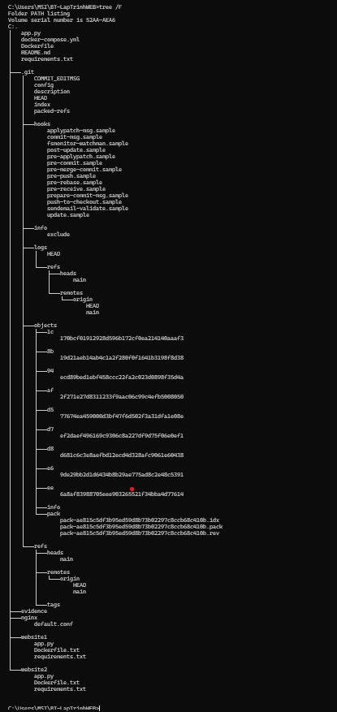
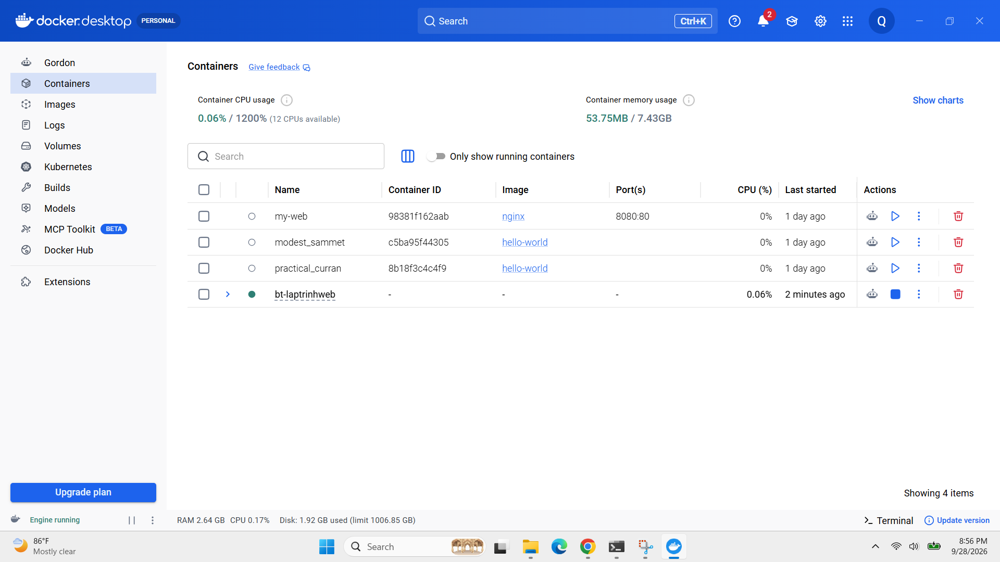
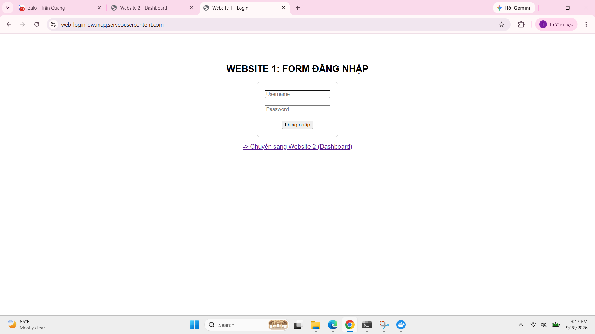
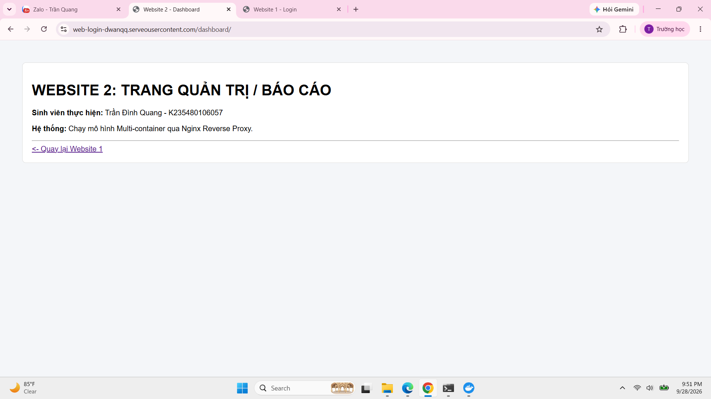

# BÁO CÁO BÀI TẬP LỚN - MÔN PHÁT TRIỂN ỨNG DỤNG TRÊN NỀN WEB

---

## THÔNG TIN CHUNG

| Hạng mục | Chi tiết |
| :--- | :--- |
| **Môn học** | **Phát triển ứng dụng trên nền web** |
| **Giảng viên hướng dẫn** | Đỗ Duy Cốp |
| **Sinh viên thực hiện** | **Trần Đình Quang** |
| **Mã sinh viên (MSSV)** | `K235480106057` |
| **Lớp** | K59KMT |
| **Repository** | [BT-LapTrinhWEB](https://github.com/DWanqq/BT-LapTrinhWEB) |
| **Tên miền Public** | [web-login-dwanqq.serveousercontent.com](https://web-login-dwanqq.serveousercontent.com) |

---

## CẤU TRÚC HỆ THỐNG VÀ NỘI DUNG THỰC HIỆN

* **Website 1:** Môi trường Web Login phát triển bằng Python Flask.
* **Website 2:** Trang Quản trị/Dashboard báo cáo hệ thống.
* **Nginx Reverse Proxy:** Điều hướng người dùng giữa 2 Website trên cùng cổng 80.
* **Docker Compose:** Đóng gói và quản lý đa container tự động.

---

## HÌNH ẢNH MINH HỌA VÀ KẾT QUẢ DEMO

### 1. Cấu trúc Cây thư mục Dự án

---

### 2. Trạng thái Docker Compose Containers

---

### 3. Giao diện Website 1 (Form Đăng nhập)

---

### 4. Giao diện Website 2 (Trang Quản trị / Dashboard)
